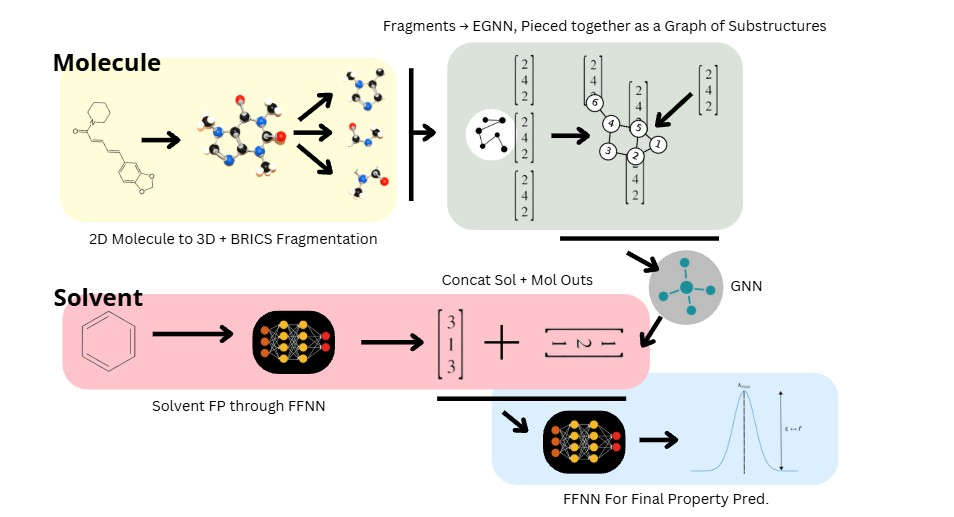
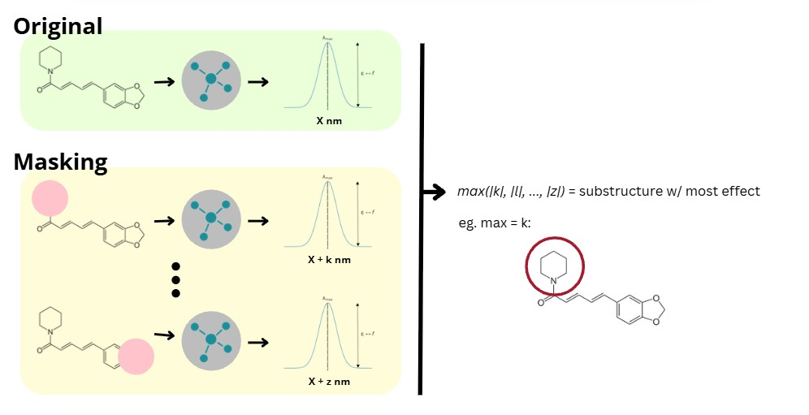

# GNN-Fluorescence-REHS2026
Project for Research Experience for High School 2026 by Krish Nandola and Jake Kuo under the guidance of Dr. Andreas Goetz and Dr. Vikrant Tripathy. In collaboration with San Diego Supercomputing Center, UCSD.

## Abstract

Determining the absorbance, emission, and lifetime of chromophores in different solvents using machine learning-assisted chemistry. 

## Frameworks

### Current Architecture

The current architecture of the model, based off of Qu, S. and Park, C. (2025) work in GoMS: Graph of Molecular Substructure Network for Molecule Property Prediction.

---

### SME

Dropout of fragments in the molecule, allowing the model to determine the most important pieces of the molecule for prediction. Allows the creation of heat-maps and other visual aids, as seen in `./plots-visuals`.

## Requirements
- cirpy==1.0.2
- egnn_pytorch==0.2.8
- matplotlib==3.11.0
- numpy==2.5.1
- pandas==3.0.3
- rdkit==2026.3.3
- scikit_learn==1.9.0
- torch==2.12.1
- torch_geometric==2.8.0

Quick install requirements with `pip install -r requirements.txt`

## References
---
Beard, E.J., Sivaraman, G., Vázquez-Mayagoitia, Á., Vishwanath, V. and Cole, J.M. (2019). Comparative dataset of experimental and computational attributes of UV/vis absorption spectra. Scientific Data, 6(1). doi:10.1038/s41597-019-0306-0.

Joung, J.F., Han, M., Jeong, M. and Park, S. (2020). Experimental database of optical properties of organic compounds. Scientific Data, 7(1). doi:10.1038/s41597-020-00634-8.

Potapov, D., Rogovoi, S., Khrabrov, K., Ushenin, K., Korovin, A., Ber, A., Kadurin, A. and Tsypin, A. (2026). A conformational benchmark for optical property prediction with solvent-aware graph neural networks. Communications Chemistry, [online] 9(1). doi:10.1038/s42004-026-01944-5.

Qu, S. and Park, C. (2025). GoMS: Graph of Molecule Substructure Network for Molecule Property Prediction. [online] arXiv.org. Available at: https://arxiv.org/abs/2512.12489 [Accessed 14 July 2026].

Wu, Z., Wang, J., Du, H., Jiang, D., Kang, Y., Li, D., Pan, P., Deng, Y., Cao, D.S., Hsieh, C.Y. and Hou, T. (2023). Chemistry-intuitive explanation of graph neural networks for molecular property prediction with substructure masking. Nature Communications, 14(1). doi:10.1038/s41467-023-38192-3.